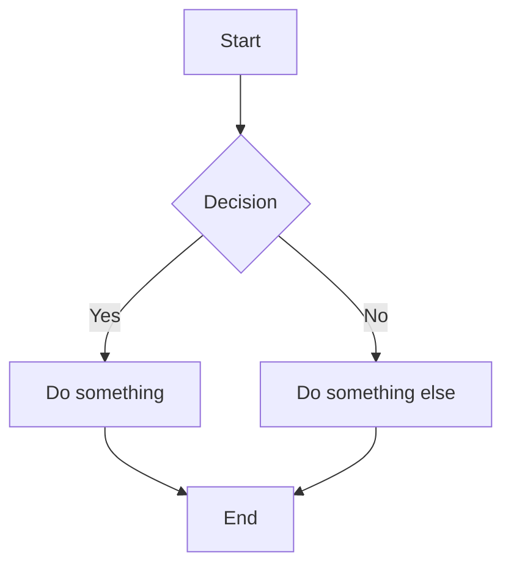

# LiveMark Tutorial

Welcome to **LiveMark** — a desktop Markdown editor with seamless inline live-preview. What you type is what you see, no split panes or preview toggles needed.

This document showcases every feature LiveMark supports. Open it in LiveMark to see the live rendering in action!

---

## Headings

Markdown supports six levels of headings. Type `#` followed by a space to create one:

# Heading 1

## Heading 2

### Heading 3

#### Heading 4

##### Heading 5

###### Heading 6

---

## Text Formatting

LiveMark supports all standard inline formatting. These render live as you type:

- **Bold** — wrap text with `**double asterisks**`
- *Italic* — wrap text with `*single asterisks*`
- ~~Strikethrough~~ — wrap text with `~~double tildes~~`
- `Inline code` — wrap text with `` `backticks` ``

You can also **combine *formatting* together** for **~~bold strikethrough~~** and other combinations.

---

## Links

Create links with `[text](url)` syntax:

- [LiveMark on GitHub](https://github.com/user/livemark)
- [Markdown Guide](https://www.markdownguide.org "The Markdown Guide")

**Tip:** Hold `Cmd` (or `Ctrl`) and click a link to open it in your default browser.

---

## Images

Insert images with `` syntax:


You can also **drag and drop** images directly into the editor, or **paste** them from your clipboard. LiveMark will automatically save the image alongside your document.

---

## Lists

### Unordered Lists

Type `-`, `+`, or `*` followed by a space to start a bullet list:

- First item
- Second item
  - Nested item A
  - Nested item B
- Third item

### Ordered Lists

Type a number followed by `.` and a space:

1. First step
2. Second step
3. Third step

### Task Lists

Type `- [ ]` for unchecked or `- [x]` for checked items:

- [x] Design the feature
- [ ] Implement the parser
- [ ] Write tests
- [ ] Update documentation

Click the checkbox in live-preview mode to toggle the task state!

---

## Blockquotes

Type `>` followed by a space:

> "Markdown is intended to be as easy-to-read and easy-to-write as is feasible."
>
> — John Gruber

Blockquotes can contain other elements:

> ### Quote with a heading
>
> - And a list inside
> - With multiple items
>
> And a regular paragraph too.

---

## Code Blocks

Type three backticks (```` ``` ````) followed by a language name and press space:

```javascript
function greet(name) {
  console.log(`Hello, ${name}!`);
  return { greeting: `Welcome to LiveMark` };
}
```

```python
def fibonacci(n):
    """Generate Fibonacci sequence up to n terms."""
    a, b = 0, 1
    for _ in range(n):
        yield a
        a, b = b, a + b

print(list(fibonacci(10)))
```

```rust
fn main() {
    let message = String::from("Hello from Rust!");
    println!("{}", message);
}
```

```css
:root {
  --bg-primary: #ffffff;
  --text-primary: #1a1a2e;
  --accent: #4a9eff;
}

body {
  font-family: 'Inter', system-ui, sans-serif;
  line-height: 1.6;
  color: var(--text-primary);
}
```

LiveMark supports syntax highlighting for many languages including JavaScript, TypeScript, Python, Rust, Go, Java, C, C++, CSS, HTML, JSON, YAML, Bash, and SQL.

---

## Tables

Create tables using pipe `|` and dash `-` syntax:

| Feature | Status | Priority |
| --- | --- | --- |
| Live Preview | Done | P0 |
| File Operations | Done | P0 |
| Export | Done | P1 |
| Themes | Done | P1 |
| Tables | Done | P1 |

### Alignment

Use colons in the separator row to control column alignment:

| Left-aligned | Centered | Right-aligned |
| --- | --- | --- |
| Apple | Red | $1.20 |
| Banana | Yellow | $0.50 |
| Grape | Purple | $2.00 |

**Tip:** Press `Tab` to navigate between table cells, `Shift+Tab` to go back.

---

## Horizontal Rules

Create a horizontal divider by typing `---`, `***`, or `___` followed by a space:

---

Use them to separate major sections of your document.

---

## Math

### Inline Math

Wrap LaTeX expressions with single dollar signs: $E = mc^2$

Other examples: $\alpha + \beta = \gamma$, $\sum_{i=1}^{n} x_i$

### Block Math

Type `$$` followed by a space to create a display math block:

$$
\int_{-\infty}^{\infty} e^{-x^2} dx = \sqrt{\pi}
$$

$$
f(x) = \frac{1}{\sigma\sqrt{2\pi}} e^{-\frac{(x-\mu)^2}{2\sigma^2}}
$$

---

## Mermaid Diagrams

Create diagrams using [Mermaid](https://mermaid.js.org/) syntax inside fenced code blocks with the `mermaid` language tag:



Mermaid is lazy-loaded — the library only downloads when you first use a diagram. Supported diagram types include flowcharts, sequence diagrams, class diagrams, state diagrams, and more.

---

## YAML Frontmatter

LiveMark supports **YAML frontmatter** at the top of your document. Wrap metadata in triple dashes:

```yaml
---
title: My Document
date: 2024-01-15
tags: [markdown, tutorial]
---
```

Frontmatter is displayed in a styled card in the editor and preserved when saving. It's commonly used for static site generators, blog posts, and document metadata.

---

# App Features

LiveMark is more than a Markdown editor — it comes with a full set of productivity features. The quickest way to discover them all is the **command palette**: press `Cmd+Shift+P` to open it, then start typing to fuzzy-search for any action — file operations, formatting, export, theme switching, and more.

---

## Command Palette

Press `Cmd+Shift+P` to open the command palette. Every action in LiveMark is registered here, so it doubles as a cheat sheet. Just start typing to filter commands — no need to memorize shortcuts.

---

## Tabs

LiveMark supports **multi-tab editing** — open multiple files and switch between them with tabs at the top of the window. Each tab preserves its own editor state (cursor position, scroll, undo history). Close a tab with `Cmd+W` or by clicking the close button on the tab.

---

## Sidebar

Press `Cmd+\` to toggle the **file tree sidebar**. It shows files in the current directory so you can quickly navigate and open them. You can also drag and drop files from the sidebar into the editor area.

---

## Block Handles

Hover over any block (paragraph, heading, list, code block, etc.) to reveal a **grip handle** on the left side. The handle provides:

- **Drag to move** — grab the handle and drag to reorder blocks
- **Context menu** — right-click (or click) the handle for options: move up/down, duplicate, delete, and copy link to block
- **Plus button** — click the `+` icon to insert a new block above. A picker lets you choose the block type: paragraph, heading (H1–H3), bullet list, ordered list, task list, blockquote, code block, horizontal rule, or math block

---

## Mind Map

Press `Cmd+T` to open the **mind map view**. It renders your document's heading structure as an interactive diagram using Mermaid, giving you a visual overview of the document outline.

---

## Find & Replace

Press `Cmd+F` to open the find & replace bar. It supports case-sensitive matching and replaces across the entire document.

---

## Source View

Press `Cmd+/` to toggle source view. This shows the raw Markdown source of your document in a read-only view. Toggle back to return to the live-preview editor. Your scroll position is preserved when switching between views — scroll to any section, toggle, and you'll land in the same place.

---

## Focus Mode

Press `Cmd+Shift+F` to toggle focus mode. In focus mode, only the paragraph you're currently editing is fully visible — surrounding blocks are dimmed. This helps you concentrate on the content you're actively writing.

---

## Review Panel

Press `Cmd+Shift+R` to open the review panel. It analyzes your document for quality issues:

- **Empty headings** — headings with no content
- **Heading hierarchy skips** — jumping from h1 to h3 without h2
- **Duplicate headings** — identical heading text
- **Missing image alt text** — images without descriptive alt text
- **Empty links** — links with no URL
- **Code blocks without language** — fenced blocks missing a language tag
- **Long paragraphs** — paragraphs over 300 words
- **Missing document title** — no h1 heading in the document

Click any item in the panel to jump to that location in the editor. The panel updates live as you type.

---

## Export

LiveMark can export your documents in multiple formats:

- **HTML** — standalone HTML file with embedded styles
- **PDF** — via the system print dialog
- **Copy as HTML** — copy rendered HTML to clipboard
- **Copy as Markdown** — copy raw Markdown to clipboard (selection-aware: copies only the selected range if you have one)
- **Copy as Beautiful Doc** — styled HTML clipboard copy for pasting into rich editors like Google Docs or Notion

Access export options through the command palette (`Cmd+Shift+P`) or keyboard shortcuts.

---

## Themes

LiveMark supports **Light** and **Dark** themes, plus a **System** option that follows your OS preference. Toggle with `Cmd+Shift+T`, from the status bar, or the command palette.

---

## Auto-Save

LiveMark automatically saves your file 30 seconds after your last edit (when the file has a path on disk). You can toggle auto-save on or off from the status bar button at the bottom-right. When auto-save triggers, a brief "Auto-saved" indicator appears in the status bar.

---

## Keyboard Shortcuts

| Shortcut | Action |
| --- | --- |
| `Cmd+Shift+P` | **Command palette** (find any action) |
| `Cmd+B` | Toggle **bold** |
| `Cmd+I` | Toggle *italic* |
| `Cmd+Shift+X` | Toggle ~~strikethrough~~ |
| `` Cmd+` `` | Toggle `inline code` |
| `Cmd+1` through `Cmd+6` | Set heading level |
| `Cmd+Z` | Undo |
| `Cmd+Shift+Z` | Redo |
| `Cmd+O` | Open file |
| `Cmd+S` | Save file |
| `Cmd+Shift+S` | Save as |
| `Cmd+N` | New file |
| `Cmd+W` | Close tab |
| `Cmd+F` | Find & replace |
| `Cmd+/` | Toggle source view |
| `Cmd+\\\\` | Toggle sidebar |
| `Cmd+T` | Toggle mind map |
| `Cmd+Shift+R` | Toggle review panel |
| `Cmd+Shift+F` | Toggle focus mode |
| `Cmd+Shift+T` | Cycle theme |
| `Cmd+=` | Zoom in |
| `Cmd+-` | Zoom out |
| `Cmd+0` | Reset zoom |
| `Cmd+Shift+E` | Export as HTML |
| `Cmd+P` | Print / Export PDF |
| `Cmd+Shift+C` | Copy as HTML |
| `Cmd+Alt+C` | Copy as Markdown |

---

## Tips & Tricks

 1. **Click below the last block** to create a new paragraph at the end of the document
 2. **Press Enter at the end of a code block** to exit and create a new paragraph
 3. **Drag and drop images** from Finder directly into the editor
 4. **Paste images** from your clipboard — they auto-save next to your file
 5. **Use the status bar** at the bottom to see word count, line/column, and toggle themes
 6. **Open files from the terminal** with `livemark path/to/file.md`
 7. **Hover block handles** to quickly reorder, duplicate, or delete blocks
 8. **Use the `+` button** on block handles to insert any block type without memorizing syntax
 9. **Open multiple files in tabs** to work on several documents at once
10. **Toggle the sidebar** with `Cmd+\` for quick file navigation

---

*Happy writing with LiveMark!*